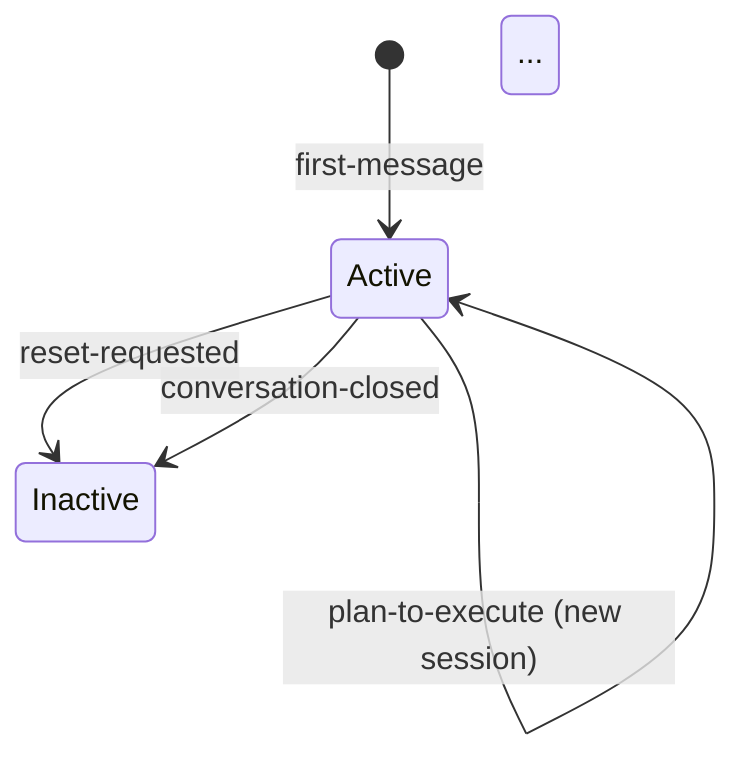

# Harness Analysis: `<harness-name>`

> 이 파일은 빈 템플릿. 실제 분석 시 복사해서 채운다.
>
> **핵심**: 이 문서는 두 파트다. **Part 1이 문서의 절반 이상**을 차지한다. Part 1은 다이어그램 여러 장 + 각각을 풀어주는 서술 — "어떻게 도는지"가 한 번 읽어서 그려지게. Part 2는 참조용으로 간결하게.

---

## 0. Metadata

- **이름**: 
- **종류**: (external wrapper / CLI agent / in-harness skill system / hybrid)
- **저장소**: (URL 또는 로컬 경로)
- **분석 커밋/버전**: 
- **분석 일시**: (YYYY-MM-DD)
- **주 언어/런타임**: 
- **주 LLM 공급자**: 

## TL;DR — 한 문단 요약

> 이게 무엇이고, 누굴 위한 것이고, 결정적 특징이 무엇인지 3-5 문장. 독자가 이 한 문단만 읽고도 "아 이런 거구나" 감이 잡히게.

---

# Part 1: The Story

> **이 파트가 문서의 중심이다**. 아래는 채워야 할 다이어그램 슬롯들. 하네스 특성에 맞게 다이어그램 종류를 고른다 — 최소 3장, 보통 3-5장이 적당.

## 1-1. Main Flow (필수)

> 유저 메시지 하나가 들어와서 응답이 나갈 때까지의 **주 경로**. ASCII 또는 Mermaid. 진입점 · 라우팅 분기 · 컨텍스트 조립 · LLM 호출 · 응답 반환이 모두 보여야 한다.
>
> **박스 규칙**: 각 박스에 ① 한국어로 무슨 일인지 + ② 코드/함수명 + file:line — 둘 다.
> ```
> ┌─────────────────────────────────────────────────────┐
> │  무슨 일인지 한국어 (이게 먼저)                        │
> │  (필요하면 부연 한 줄)                                │
> │  FunctionName()  ·  file:line                       │
> └─────────────────────────────────────────────────────┘
> ```

```
(다이어그램)
```

### Narration

> 2-4 문단. 숫자 목록 캡션 반복 금지. "이 그림이 보여주는 이야기" → "주요 순간들 밟아가며 서술" → "덧붙일 맥락" 순서로. 파일 인용은 괄호로 흘려 넣기.

## 1-2. Alternate Paths

> Main flow에서 갈라지는 분기들. 두 개 이상이면 **다이어그램을 따로**. 슬래시 커맨드, 워크플로우 디스패치, 승인 재개, 에러 경로 등.
> 박스 규칙은 1-1과 동일. 분기 박스도 조건의 의미를 한국어로 먼저 쓰고 코드 참조를 붙인다.

### (a) 분기 이름 — 예: 슬래시 커맨드로 직접 실행

```
(다이어그램 또는 시퀀스)
```

### Narration
> 이 경로가 언제 발동되는지, 메인과 어디서 갈라지고 어디서 합류하는지 2-3 문단.

### (b) 또 다른 분기 이름

...

## 1-3. (특징적 측면 다이어그램들)

> 이 하네스의 **특별한 지점**을 보여줄 다이어그램 1-3장. 하네스에 따라 다름:
>
> - **Session state transitions** — 상태 다이어그램(Mermaid `stateDiagram-v2` 추천)
> - **Isolation resolver decision tree** — 결정 트리(텍스트 트리 또는 `flowchart`)
> - **Workflow DAG execution** — 시퀀스 다이어그램
> - **Routing decision** — 결정 트리
> - **Context assembly sequence** — 시퀀스 다이어그램
> - **Component architecture** — 패키지 간 의존 그래프
> - **Skill/plugin dependency network** — (in-harness 스킬 시스템인 경우)
>
> 각 다이어그램 아래 narration 2-3 문단. **뭘 보여주고 왜 이 하네스에서 특별한가**를 이야기로.

### 예: Session State Transitions



### Narration

> 이 상태 다이어그램은 세션이 어떻게 생기고 언제 전환되는지를 보여준다. Archon의 재미있는 지점은 **세션이 불변이라는 것** — 상태를 바꾸지 않고 새 세션을 만들어 `parent_session_id`로 가리킨다...

---

# Part 2: Reference Details

> **간결하게**. 각 차원 1-3 문장이 원칙. Part 1에서 이미 다룬 것은 반복하지 말고, 구체 수치·파일 경로·테이블 같은 **보조 정보 위주**로.
>
> 해당 없으면 "해당 없음 — (왜 없는지)" 한 문장으로 종료.

## 2-1. Entry Points
> 진입점 종류와 공통 디스패처. 각 어댑터의 인증 방식.

## 2-2. Concurrency
> 동시성 한도, 락, 큐, 초과 시 동작.

## 2-3. Routing
> 결정론 계층 유무, AI 라우팅 프롬프트 위치, 번복 가능성.

## 2-4. Context Assembly
> 조립되는 항목 목록, 단일 지점인지 분산인지, 변수 치환 규칙.

## 2-5. Provider Abstraction
> 인터페이스 위치, SDK 격리 전략, 새 공급자 추가 비용.

## 2-6. Worker / Execution
> 실행 단위, 옵션 전달 경로, abort/timeout 전파.

## 2-7. Message Loop
> 스트림 vs 배치 처리, 청크 타입, 라우팅 토큰 감지.

## 2-8. Session / State
> 세션 모델(mutable/immutable), 전환 트리거 목록, 만료 정책.

## 2-9. Isolation
> 격리 기술, resolver 우선순위, 권한 경계.

## 2-10. Tool / Capability
> 내장 도구, 확장점(MCP/hooks/skills), per-node override 여부.

## 2-11. Workflow Engine
> 존재 여부. 있으면 정의 형식, 노드 타입, 실행 모델, 조건 분기.

## 2-12. Configuration
> 계층 순서, 병합 전략, 런타임 재로드 가능성.

## 2-13. Error Handling
> 철학(Fail Fast 여부), 분류 함수, 재시도 정책.

## 2-14. Observability
> 로거, 이벤트 네이밍, 저장 위치, 외부 통합.

## 2-15. Platform Adapters
> 인터페이스 메서드, 지원 플랫폼, 스트리밍 모드 분류.

## 2-16. Persistence
> DB 종류, 주요 테이블, 민감정보 취급.

## 2-17. Security Model
> 신뢰 모델, 인증 지점, 시크릿 저장.

## 2-18. Key Design Decisions & Tradeoffs

> 이 차원은 표가 적합 — 표 위에 한 문단 서문으로 방향 제시.

| 결정 | 선택 | 대안 | 근거 (추론) | 트레이드오프 |
|------|------|------|-------------|-------------|
|      |      |      |             |             |

## 2-19. Open Questions

> 확인 못 한 것들. 각 질문을 해결할 힌트까지 한 줄씩.

- 
- 

---

## Appendix: Quick Reference Table (비교용)

| 항목 | 값 |
|------|-----|
| Type | |
| Entry points | |
| Concurrency | |
| Router style | |
| Provider abstraction | |
| Session model | |
| Isolation | |
| Workflow engine | |
| Primary language | |
| LoC (approx) | |
